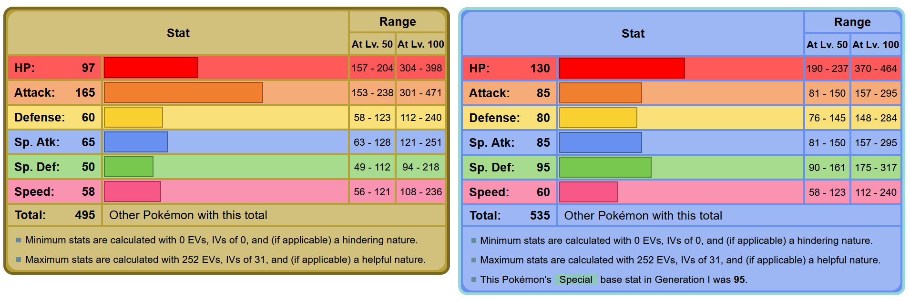

# Sinnoh-EV-Calculator

Simple EV calculator for use as a Pokemon is EV trained.
Enter simple information to start, then enter names of Pokemon as they are defeated.
Calculator will keep track of EVs, including modifiers such as PokeRus and items.
Despite the name, able to be used with any generation/PokeDex, given that input .txt file is in alphabetical order, with name and EVs separated by spaces (included are the Sinnoh Dex and National PokeDex, with EVs coinciding with Gen IV)

## Inputs:
### Beginning
- Name
- Goal EVs
- Current EVs
- Has PokeRus?
- Has modifier items?
### During
- Numbers
    - 1: Save
    - 2: Pokerus status change (i.e. gained)
    - 3: Change item
    - 4: Change PokeDex
- Name of Pokemon caught

## What are EVs? + a lecture on Pokemon Training
Pokemon have 6 stats: HP (Hit Points (health)), Attack, Defense, Special Attack, Special Defense, and Speed. These stats are calculated based on:
1. **the Pokemon's species**: each Pokemon has its own set of base stats. For example:
    
    On the left is Rampardos's stats, and on the right is Lapras's. Rampardos has naturally high Attack, while Lapras has naturally high HP.
2. **its Nature**: Pokemon have 1 of 25 natures assigned to them, 20 of which raise one stat and lower another (neither stat is HP). The remaining 5 make no changes. There are ways to control the nature of Pokemon encountered in the wild or hatched from eggs, and (as of Gen VIII) methods to change which nature's *effects* a Pokemon has.
3. **its IVs (Individual Values)**: when a Pokemon is hatched, each of its 6 stats is assigned a random (again, kinda) number from 0 to 31, with 31 being the highest boost a stat can get. IVs are not explicitly shown to the player, and may control some aspects of a Pokemon (the type of its Hidden Power, its Characteristic statement, etc). Once a Pokemon is 'created', there is no way to change the IVs themselves, but newer games have introduced mechanics that allow damage calculation to treat IVs as if they are full, usually after meeting some (insane) criteria, e.g. getting to Level 100.
4. **its EVs (Effort Values)**: EVs all start at 0, and go up depending on which Pokemon is defeated. For example, defeating a Rampardos gives 2 Attack EVs, while defeating a Lapras gives 2 HP EVs. The maximum amount of EVs a Pokemon can have in total is 510, and the maximum (that counts toward a stat) for one stat is 252. When stats are calculated, the EVs in each stat is (int) divided by 4 and applied, so "maximizing" 2 stats means a spread of 252 to two stats, 4 to one stat, and 2 remaining (usually dumped with the 4). Older games capped the stats at 255, so counting EVs was important (hence why this program exists). Newer games cap each stat's EVs at 252 and have the total as 508. Unlike IVs, EVs can be reset using berries (Pomeg, etc)

## EV-Modifiers
**PokeRus** - A rare (1/21,845; rarer than shiny), contagious, beneficial 'disease' that causes a Pokemon to gain twice as many EVs as it otherwise should (including those agined from items). PokeRus is "cured" after 1-4 (depending on "strain") days, but can be suspended by placing in a PC. A cured Pokemon can't catch or spread PokeRus, but will continue gaining twice as many EVs.
**Macho Brace** - Item that doubles EVs gained from a battle (stacks with PokeRus), but halves holder's Speed during the battle
**Power Weight** (green) - Item that grants 4 (8 after gen VII) EVs to HP (stacks with PokeRus), but halves holder's Speed during the battle
**Power Bracer** (red) - Item that grants 4 (8 after gen VII) EVs to Attack (stacks with PokeRus), but halves holder's Speed during the battle
**Power Belt** (orange) - Item that grants 4 (8 after gen VII) EVs to Defense (stacks with PokeRus), but halves holder's Speed during the battle
**Power Lens** (pink; vertical) - Item that grants 4 (8 after gen VII) EVs to Special Attack (stacks with PokeRus), but halves holder's Speed during the battle
**Power Band** (yellow) - Item that grants 4 (8 after gen VII) EVs to Special Defense (stacks with PokeRus), but halves holder's Speed during the battle
**Power Anklet** (blue) - Item that grants 4 (8 after gen VII) EVs to Speed (stacks with PokeRus), but halves holder's Speed during the battle
Note: A Pokemon can only hold 1 item at a time
